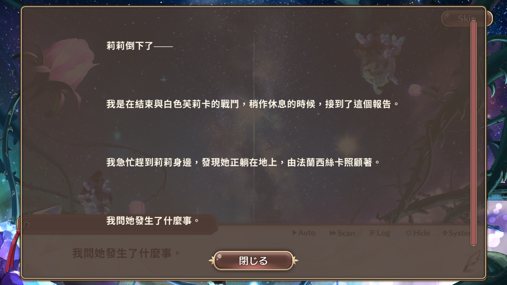
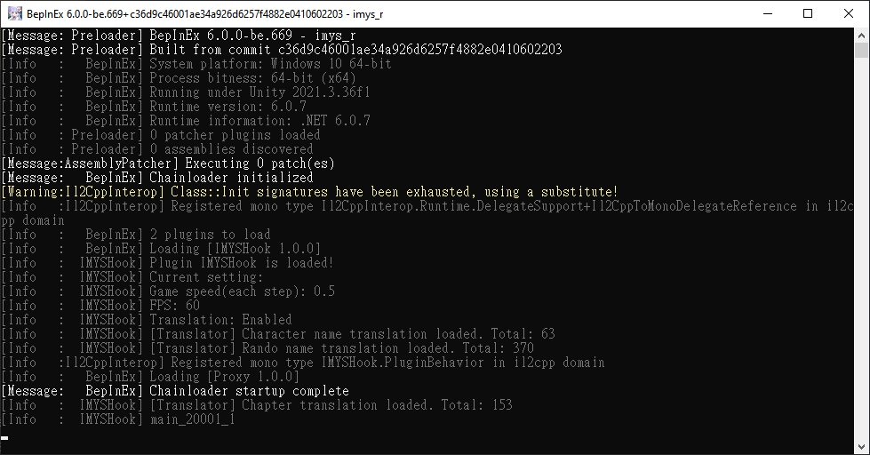
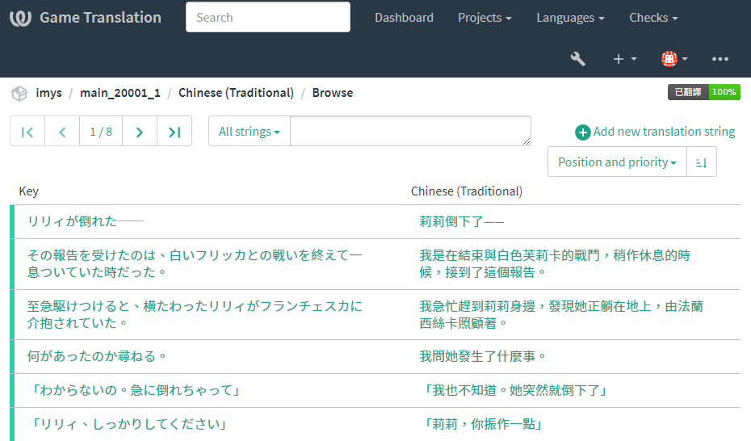
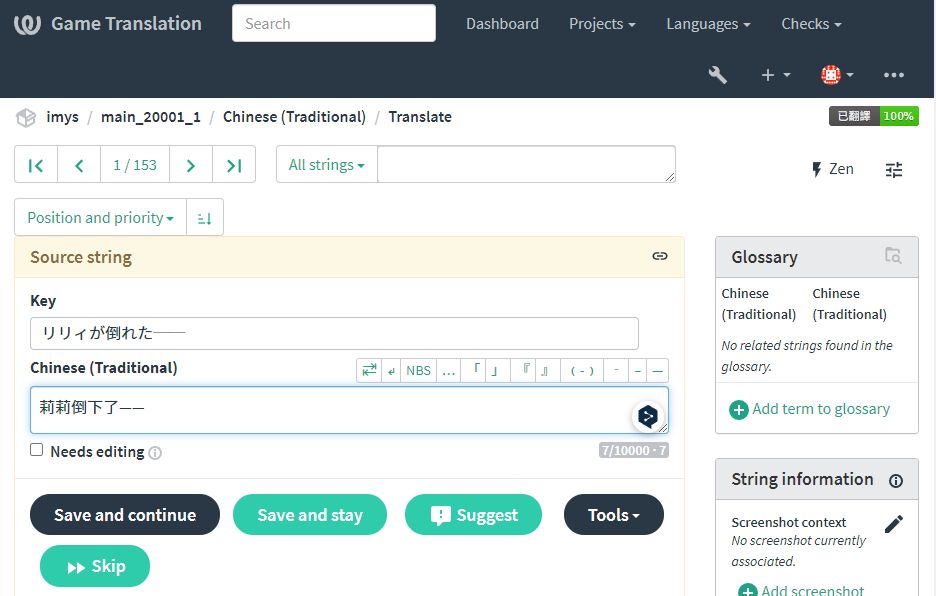

## 禁止利用相關資源作為商業用途

## 禁止利用相關資源作為商業用途

## 禁止利用相關資源作為商業用途

## 很重要所以說三次

### 翻譯狀況

首先，19章前將會沿用中文版的翻譯，而20章後將採用機器翻譯+人工校對方式

因後續翻譯皆由機器翻譯所得，所以不喜歡可以上一頁 :)

但同時，也是由愛好者共同維護的翻譯

目前使用的翻譯模型: [SakuraLLM](https://github.com/SakuraLLM/Sakura-13B-Galgame)

**已知問題:** 

暫無

### 翻譯修正

部分文本已經在發佈前進行過一次人手修正

但因為目前全劇情字數高達[500萬字](https://translation.lolida.best/projects/imys/#information)

在單人維護的情況下，實在無能為力。

如果您有日文能力的話，可以為這份翻譯貢獻一己之力

任何人都可以到我們的[協作翻譯平台](https://translation.lolida.best/projects/imys/)查看及修正，感激不盡！

### 翻譯修改教學

問: 我找到某處翻譯有錯，要怎麼修正?

答: 假設，你在看第20章第1話劇情發現其中一句有問題

這時候可以切換至控制台，你會看到一個main_20001_1的文字

這個就是劇情ID

你可以在翻譯平台搜尋這個ID，也可以複製下列網址並修改劇情ID為main_20001_1即可進入相關的翻譯文本位置

`https://translation.lolida.best/browse/imys/劇情ID/zh_Hant/`

點擊相關句子後會進修改界面

修改後，按**Save and stay**即可 (PS: 進行修改需要註冊帳號)

完成！
